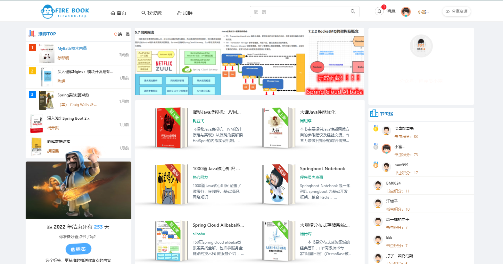

## 说在前边

这是程序员值得拥有的一个仓库，里边包含了种类非常全的编程电子书PDF，比如 `Java` 、`C++` 、`Python` ... ，`Redis` , `Node.js` , `Vue.js` , 
`大数据`, `Linux`,`Docker`, `Nginx`, `HTML`,` 面试`, `计算机组成原理`, `数据安全`, `MySQL`, `MongoDB` , `Spring Cloud` ，`ZooKeeper`，`Netty` ，`设计模式` ，
`Spring Batch` ，`Spring Boot` ，`Spring` ，`架构` ，`重构` ，`性能测试` 等等等，总共有近1000本书。

以下只是所有书籍的一小部分，如未找到你想要的，你可以跳转 [https://fire100.top](https://fire100.top) 检索

如果还是没有可能是还未来得及上传， 请联系站长获取， 可以一次性获取全部电子书

## 编程语言

### Java

#### [Java从入门到精通（第3版）（光盘内容另行下载 ，地址见书封底）](http://baidu.com) ，提取码：1223

[Java并发编程实战](https://pan.baidu.com/s/1fVRlWNy62Orcv63uSzLMlA) ，提取码：zt0w

[Java并发编程的艺术](https://pan.baidu.com/s/19vG6Dd3YBr69i6D2NHeCaQ) ，提取码：wv4f

[阿里巴巴Java开发手册(第2版)](https://pan.baidu.com/s/1Q5FgMW1sDVjl-X3x9IgXRg) ，提取码：4xas

[Java多线程编程实战指南(核心篇)](https://pan.baidu.com/s/11Z4kTgXUaQ5sMtxU5EpSCA) ，提取码：5ewk

[Java程序员修炼之道](https://pan.baidu.com/s/1FTPHxCsj4Xny8AIWXEqsdQ) ，提取码：d1kf

[深入理解Java虚拟机：JVM高级特性与最佳实践(第3版)](https://pan.baidu.com/s/1EfHsHy6qALfsjSoHz4PpEw) ，提取码：71mc

[Java性能权威指南](https://pan.baidu.com/s/1vff1hcUaPUEstEObeiY0iw) ，提取码：dh34

[Java核心技术　卷Ⅰ　基础知识（原书第10版）](https://pan.baidu.com/s/1jwu95MCmwpDDMl0R3lKz2w) ，提取码：nvyx

[ 像计算机科学家一样思考Java（第二版）](https://pan.baidu.com/s/1vBNf3XiYsodIf6WVAaL9sA) ，提取码：ook5

[JavaEE开发的颠覆者：Spring Boot实战](https://pan.baidu.com/s/13NyNhPAtZVf6b5AsjX-y1g) ，提取码：cd51

[ Java并发编程设计原则与模式](https://pan.baidu.com/s/1o8wfzaDrU4AXquWkiMGZow) ，提取码：npja

[代码整洁之道](https://pan.baidu.com/s/16dHqd4ktLa6FCMB4w-Zgug) ，提取码：nq1n

[ Activiti权威指南](https://pan.baidu.com/s/1Wjgd0a_CiQVtUEG-JgIKtA) ，提取码：8jef

[重构：改善既有代码的设计(第2版)](https://pan.baidu.com/s/1uG3l7lNknos1TfEQj4mVfQ) ，提取码：ywru

### Kotlin

[Kotlin实战](https://pan.baidu.com/s/1M4XqJigd7GVWBhks9nGMCQ) ，提取码：9c6h

### Python

[Python编程：从入门到实践(第2版)](https://pan.baidu.com/s/14MHvayptNyXLsMJ2maKOhQ) ，提取码：8k0k

[用Python写网络爬虫(第2版)](https://pan.baidu.com/s/1C_iRGSyTeuePg86klWS5og) ，提取码：czih

[Python爬虫开发与项目实战](https://pan.baidu.com/s/1EVjGQ7ePdlBvvFc43P8PTQ) ，提取码：ruti

## Spring

[ Spring揭秘](https://pan.baidu.com/s/1WfiqpW21Z-yCuYTpl5rocg) ，提取码：o7ks

[看透Spring MVC：源代码分析与实践](https://pan.baidu.com/s/1tW2ytOdsX-uXqd2Bdi0rag) ，提取码：cs2e

[Spring5高级编程](https://pan.baidu.com/s/1WemdFfMuqAWw0e_zRy4gvQ) ，提取码：w4m4

[Spring实战(第4版)](https://pan.baidu.com/s/1GRLidzJixPZbhR5Sc8az8A) ，提取码：6byp

[Spring 3.0就这么简单](https://pan.baidu.com/s/1uG2r1TIa2oYjL43qLP0-og) ，提取码：e76r

## Springboot 

[Springboot-Notebook](https://github.com/chengxy-nds/Springboot-Notebook) 

[SpringBoot揭秘：快速构建微服务体系](https://pan.baidu.com/s/11vIjIxg1lEo32A6Qymqf1Q) ，提取码：f540

[ Spring Boot实战](https://pan.baidu.com/s/1AdNsrtm7in74mV9mf24gAA) ，提取码：isqw

[ 深入浅出Spring Boot 2.x](https://pan.baidu.com/s/18v4gEky5VtjFAW7XV7hTag) ，提取码：ubuf

## SpringCloud

[Spring Cloud Alibaba微服务实战全解](https://pan.baidu.com/s/1fbMdIiOSe35jQiyFuu5paw) ，提取码：wxm1

[ 深入理解Spring Cloud与微服务构建](https://pan.baidu.com/s/1wBUbqzqh-8XVNqupeB9nXQ) ，提取码：5yww

[ Spring Batch批处理框架](https://pan.baidu.com/s/17t8iikf7PwL-Dzwtf5jzcg) ，提取码：xcms

[ Spring Cloud与Docker微服务架构实战](https://pan.baidu.com/s/1s0kSQv1PlUN-vCfZKAlCGA) ，提取码：411q

[Spring Cloud微服务实战](https://pan.baidu.com/s/1ueetR0Qo6-EJPc5V_eznSg) ，提取码：jae0

## 数据结构 && 算法

[算法图解](https://pan.baidu.com/s/1_4MifhrJSem2qDIlviF7HQ) ，提取码：go6s

[算法(第4版)](https://pan.baidu.com/s/1VKcztjIKRRsdliaRukII2Q) ，提取码：8w2e

[ 漫画线性代数](https://pan.baidu.com/s/1TqrrXiMG9IPlgG6v11TUvw) ，提取码：19mo

[ 算法导论（原书第3版）](https://pan.baidu.com/s/1vcwJ4bemUtbwIrWKnLNXVg) ，提取码：ry16

[ 图解数据结构](https://pan.baidu.com/s/1TWT9frWO8J9BNpmpQy9ecA) ，提取码：mhlw

[大话数据结构](https://pan.baidu.com/s/16ve4eAzYpK9-pdJNwjzjsg) ，提取码：dhu1

[ 数据结构与抽象：Java语言描述（原书第4版）](https://pan.baidu.com/s/1S2zC58QX-mQhGOuJBN35dA) ，提取码：m9eg

[ 算法的乐趣](https://pan.baidu.com/s/1aXKZzNSI4VQo_IjtW9R3oQ) ，提取码：v0qd

[ 数据结构与算法经典问题解析：Java语言描述(原书第2版）](https://pan.baidu.com/s/1RMO6GciB9_25Rqh8JVh4Kw) ，提取码：ga2m

## 架构

[云计算架构技术与实践](https://pan.baidu.com/s/1zKK68BQ0nXD2Ns2C9ucpdA) ，提取码：q875

[程序员之软件架构](https://pan.baidu.com/s/1bLgfu-WBENrnsuZSfQaxGQ) ，提取码：214g

[大型网站技术架构：核心原理与案例分析](https://pan.baidu.com/s/152xJH9E5eBg2sWnmUufC8Q) ，提取码：lybh

[京东技术解密](https://pan.baidu.com/s/1_7NjtlNZwnMaAu-7oa6obw) ，提取码：fq53

[大规模分布式存储系统:原理解析与架构实战](https://pan.baidu.com/s/16e72m5bSAPhNrvM2djHxMA) ，提取码：vakk

[ 架构即未来现代企业可扩展的Web架构流程和组织(原书第2版)](https://pan.baidu.com/s/129FYR9y-l8AMO4XibogVRg) ，提取码：dnq1

[架构探险 从零开始写javaweb框架](https://pan.baidu.com/s/1T3jO3bQdQE0YkZleGVURNg) ，提取码：wscu

[人人都是架构师：分布式系统架构落地与瓶颈突破](https://pan.baidu.com/s/1f95eHiPiKfV2dEhOnLdZlg) ，提取码：bl9f

[ 软件构架实践(第2版)](https://pan.baidu.com/s/1FKs2s22Vnhzn5PrtjUFUlw) ，提取码：vuyn

## Redis

[ Redis 深度历险：核心原理与应用实践](https://pan.baidu.com/s/1aG8yO-J6K9jkkzLYpF0SrQ) ，提取码：ocxk

[Redis开发与运维](https://pan.baidu.com/s/1MiFaK2N8E0aLdf4aX695-w) ，提取码：rrpy

[Redis实战](https://pan.baidu.com/s/1wxnRRS_45FIoZE0HG5FCnA) ，提取码：e4sc

[Redis设计与实现](https://pan.baidu.com/s/13P6K4KzlZG3I2wjjAjluHg) ，提取码：okil

[左手MongoDB ，右手Redis——从入门到商业实战](https://pan.baidu.com/s/1KVPk6ZqYwzaLDrYZC5NXpw) ，提取码：jj3f

## ZooKeeper

[ ZooKeeper分布式过程协同技术详解](https://pan.baidu.com/s/107MhuzjA08bwnMZSzUfDhw) ，提取码：u0lc

[从Paxos到Zookeeper：分布式一致性原理与实践](https://pan.baidu.com/s/1KnmlxvwiYqLvk_GeuGkv-w) ，提取码：j2ms

## MyBatis

[ iBATIS框架源码剖析](https://pan.baidu.com/s/1jsdt7RNcHtplKe_DuabLew) ，提取码：nnhr

[MyBatis从入门到精通](https://pan.baidu.com/s/1dzn93KH-C3No1_ONr4YB2A) ，提取码：5g4h

[MyBatis技术内幕](https://pan.baidu.com/s/17AKWSMnSMMRzEkXHIBHS8Q) ，提取码：e8br

[一本小小的MyBatis源码分析书](https://pan.baidu.com/s/1soi50vnAP9BQdWRFEhjjQg) ，提取码：b6tk

[深入浅出MyBatis技术原理与实战](https://pan.baidu.com/s/180-2sIP-Kc-d3ldQCCYxhA) ，提取码：ic5d

## MongoDB

[ MongoDB权威指南(第2版) ](https://pan.baidu.com/s/15b4C0Be8ypLYqJQ6mSK1-g) ，提取码：tppg

[ MongoDB实战](https://pan.baidu.com/s/1X40mgyPaC5EMLbWCPKJpNw) ，提取码：oh4x

[ 深入学习MongoDB](https://pan.baidu.com/s/1nmlUdO03FxdaV49N1Flq_w) ，提取码：cbk2

[MongoDB权威指南(第3版)](https://pan.baidu.com/s/1cScpIE-J84hnYqlC-FU8GA) ，提取码：d6yo

## 大数据

### Hadoop

[ Hadoop实战 ](https://pan.baidu.com/s/1bnS3BGcptwTF-hhlqmBUiw) ，提取码：ess9

[ Hadoop权威指南（第3版 修订版） [美]Tom Whi](https://pan.baidu.com/s/1gE2r053J6nH1LGo_hn3xZw) ，提取码：m8qh

### Spark

[Spark机器学习](https://pan.baidu.com/s/1kvwU3GsInHoUEqJPFpe8nw) ，提取码：z7ju

[Spark高级数据分析(第2版)](https://pan.baidu.com/s/1Msa1_YW24Dyj9Q6xP8uwxQ) ，提取码：tquv

## Docker

[Docker实战](https://pan.baidu.com/s/1Lyi9m9MQ7FaJFgt70mMVfg) ，提取码：wd6x

[第一本Docker书 修订版](https://pan.baidu.com/s/1EUkitR2A4dYbTHEjXHNCpA) ，提取码：yu7h

[Docker技术入门与实战](https://pan.baidu.com/s/107HBKT655KaHg99S9l8w0w) ，提取码：k1ci

## MYSQL

[MySQL必知必会](111) ，提取码：11

[高性能MySQL(第3版)](https://pan.baidu.com/s/1kboC1x-RFT5nZRE9zj5Llg) ，提取码：eom3

## HTTP && 操作系统

[ 计算的本质深入剖析程序和计算机](https://pan.baidu.com/s/1ad_W5Fc726dsDF6Ff0xvrA) ，提取码：f9wv

[图解HTTP](https://pan.baidu.com/s/1RHx6-Vs0Z7mZpAZ2h2HXOQ) ，提取码：pgji

[HTTP权威指南](https://pan.baidu.com/s/1tx4SaLJkE4OzKfpZh6rzEQ) ，提取码：e1oy

[ 现代操作系统](https://pan.baidu.com/s/11Pj_xGZ-yAnMosmAR_aj7A) ，提取码：tzcp

## 设计模式

[设计模式之禅（第2版）](https://pan.baidu.com/s/1L0OiaH0iKKc8_vw0hOdwFw) ，提取码：w6wp

[大话设计模式](https://pan.baidu.com/s/1Ykx-TbiY6HV4j19LFIPDYg) ，提取码：in6y

[设计模式其实很简单](https://pan.baidu.com/s/1OXuJQH-7eifG3fNW-1TyRg) ，提取码：cjvu

[ Head First 设计模式（中文版）](https://pan.baidu.com/s/1PBHwIO4E40c_NYhuMGeYqg) ，提取码：1x60

## 搜索引擎

[深入理解Elasticsearch(原书第2版)](https://pan.baidu.com/s/1FfFEd8KHtRwV1mpVvBYLhw) ，提取码：7v5u

[ Lucene实战（第2版）](https://pan.baidu.com/s/10KdA8T5Ipou0AIzfxW2R2w) ，提取码：kru7

[ Elasticsearch大数据搜索引擎](https://pan.baidu.com/s/1q6xlx1ycaleJRAfpdyfhiA) ，提取码：g63g

[ Elasticsearch服务器开发（第2版）](https://pan.baidu.com/s/1Qjo3_Aj9J2KjWqeW2OcXLQ) ，提取码：52yj

[Elasticsearch技术解析与实战](https://pan.baidu.com/s/1Ifb2gaInu4kOCNFOK1X0Fg) ，提取码：kpcp

## 前端

### JavaScript

[JavaScript语言精粹(修订版)](https://pan.baidu.com/s/1dy80NaF-LPJyNT7LTJH1WA) ，提取码：yex1

[HTML5 Canvas核心技术：图形、动画与游戏开发](https://pan.baidu.com/s/1T_yM0GTRiNm5MUmszoMNug) ，提取码：822c

[CSS揭秘](https://pan.baidu.com/s/1r5TY2ezfi15QuENHRKVsPA) ，提取码：cmg3

[SVG精髓(第2版)](https://pan.baidu.com/s/16Si25ANSm90JSKXmC01lSQ) ，提取码：widk

[HTML5与CSS3基础教程(第8版)](https://pan.baidu.com/s/1piWf5Lo3e5gAfwB_5_r3wg) ，提取码：hel7

[HTML5与CSS3权威指南（第2版·上册）](https://pan.baidu.com/s/1fSLVV9dWt2Pja7ne42-RTA) ，提取码：9hkp

[JavaScript百炼成仙](https://m.zhangyue.com/readbook/12567484/5.html) ，提取码：

## 数据安全

[黑客攻防技术宝典：第2版.Web实战篇](https://pan.baidu.com/s/1llhron3g3OvHXQZUrsYMmA) ，提取码：t8ly

[ Netty进阶之路 跟着案例学Netty](https://pan.baidu.com/s/1H38Xkm7m-Exju5HvA1XKBw) ，提取码：2p59

[Mycat权威指南](https://pan.baidu.com/s/1aO2YiCDYNodimN_F-ljOWg) ，提取码：hu80

## 性能测试

[Web性能测试实战详解](https://pan.baidu.com/s/1nxWQZWH2s1elFvflkI7UOA) ，提取码：tlr1

[构建高性能Web站点](https://pan.baidu.com/s/1RKVTDJ5LvAjmipVUwE5BAw) ，提取码：muh6

[ 零成本实现Web性能测试](https://pan.baidu.com/s/1ReBxJMecrnlfKTNvqYqXaw) ，提取码：osgy

## 小程序

[微信小程序开发入门与实践](https://pan.baidu.com/s/1tWFB_2Ir_gtCnCES4TCyXw) ，提取码：bv9s

[小程序 ，巧应用：微信小程序开发实战(第2版)](https://pan.baidu.com/s/1MUPrG0oI3Y4HsMEJ6PH0XA) ，提取码：hswx

[ 从零开始学微信小程序开发](https://pan.baidu.com/s/1ceQAiKZ_kOiQ--b3ZUfUNQ) ，提取码：aoyf

## Git

[Git权威指南](https://pan.baidu.com/s/1jI-VqUbVj9L9rEqkGHkz2g) ，提取码：ytd1

## Maven

[Maven实战](https://pan.baidu.com/s/12jufOYAGq7uqQcQiVhsXfA) ，提取码：jyt0

## Android

[ Android开发艺术探索](https://pan.baidu.com/s/1Y5BiSIj1JGH9f3UQ-L4e-A) ，提取码：q4g5

[第一行代码——Android(第3版)](https://pan.baidu.com/s/181FeFMPosynJ9a1S_F443Q) ，提取码：0uf9

## Nginx

[ 深入理解Nginx：模块开发与架构解析（第2版）](https://pan.baidu.com/s/1tTBFaUOORG0vOjENcLF3ig) ，提取码：sq31

[实战Nginx：取代Apache的高性能Web服务器(试读本)](https://pan.baidu.com/s/1q3tBkcQeZuA4LKetfbVlqw) ，提取码：qghe

[Nginx高性能Web服务器详解](https://pan.baidu.com/s/1icAlfgFPg72xKFgfPJvFoA) ，提取码：mvem

[ 决战Nginx技术卷：高性能Web服务器部署与运维](https://pan.baidu.com/s/1AWg44GbFT0Rv7sXvexwnfg) ，提取码：67to

[循序渐进Linux 第2版](https://pan.baidu.com/s/1nkGMALCuIiLn0HRkcpztvA) ，提取码：8trf

[深入剖析Nginx](https://pan.baidu.com/s/13icqVz_0oMvvdc_ybErSSg) ，提取码：vjgb

[ 学习Nginx HTTP Server（中文版）](https://pan.baidu.com/s/1cBRYLn7zSP-igAgBCMV0BA) ，提取码：ffzp

## 工具

[PDF派](https://www.pdfpai.com/) ，提取码：

[独特工具箱](https://www.dute.org/) ，提取码：

[抖音去水印工具](http://39.105.135.147:8888/index) ，提取码：

[Redis容量预估](http://www.redis.cn/redis_memory/) ，提取码：

[Draw.io 画图神器](https://www.draw.io/) ，提取码：

## 终极奥义

[颈椎病康复指南](https://pan.baidu.com/s/1VY6TgvwEYwbSgACkrnZJDw) ，提取码：7ie2

[活着（余华经典著作）](https://pan.baidu.com/s/1cZp7F9jOAt2GNN8kQ04EHw) ，提取码：1fui

